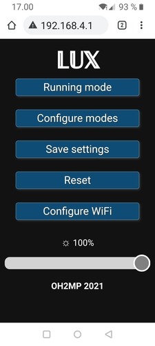
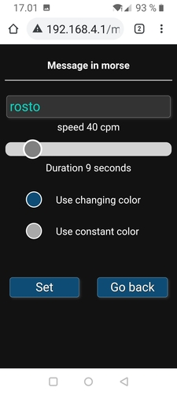

# The Portal

The UI is hopefully well optimized for mobile browsers. I am not really a web developer, so...

Connect to WiFi "THE LUX" and and take your browser to `http://192.168.4.1`

The "front page". Here you can choose running mode after boot, go configuring modes and save current settings
that will stay after next boot. The WiFi settings are an exception. They are saved separately from its page.
There is also a "global" brightness range slider.

Here you can choose the mode that is active after r boot.

Choosing the mode to configure. If you tap any of them, that mode is activated immediately, but not saved
as default after boot.

Constantly changing color configuration. The step is how long the same color stays before changing RGB values
by one. See the code.

Constant color setting. Should be quite easy to understand without explaining more.

Blink mode. As seen on the screen, the times are milliseconds how long the light stays off and on. The color
used is the same that is set from the constant color setting.

Morse mode. You can set the message, speed and color mode. Also here the constant color is taken from its own
setting. That page calculates an estimate how long the message is in seconds.

WiFi config. If the password is less than 8 characters, the AP will be open. That 8 char minimum is from
the hardware.

