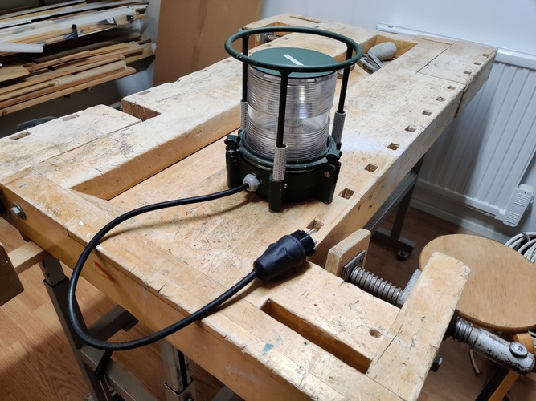
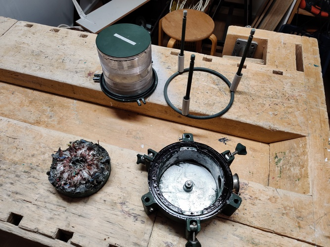
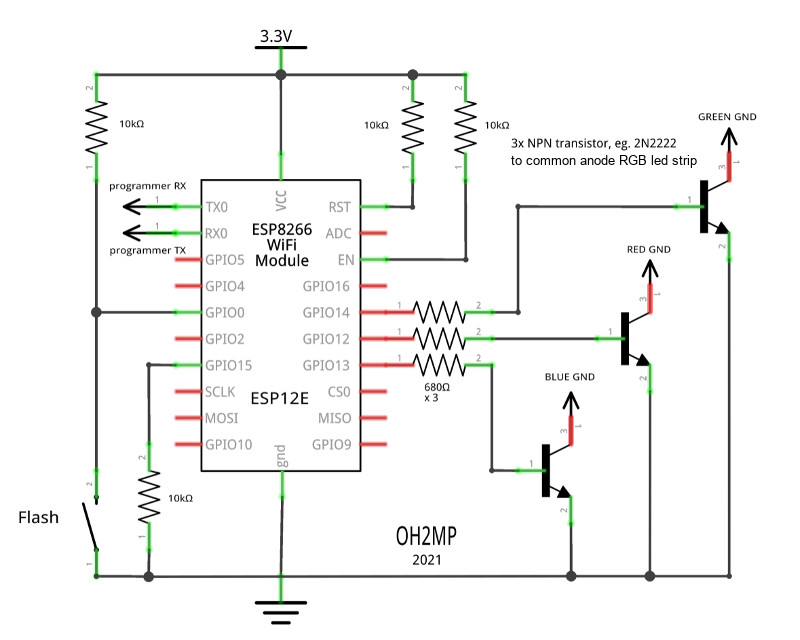
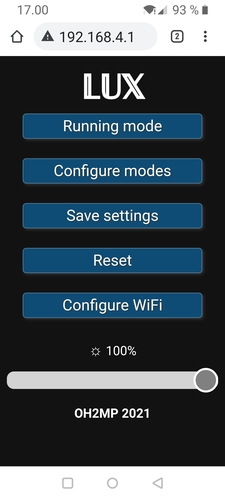

# The LUX

_An ESP8266 based WiFi configurable RGB LED strip driver_

_This circuit and program can be used for driving any common anode RGB led strip or even a single RGB led
without the transistors. Here I just explain what I built and coded._

## Background and solution

I got "semi-accidentally" an old military aviation light that had been used as a runway light when a temporary 
airport is made eg. on a highway. It had a 12V halogen lamp driven by a ring core transformer that was casted 
in epoxy and fed by some weird 400V 2 phase AC connector. Of course I couldn't use it as it was. It was 
quite a job to get the epoxy and transformer out from the case, but I succeeded with it.

I had several meters of 12V RGB strip, so I decided to make a helix of it around a plastic tube and 
put it in the light and make an ESP2866 driver for it. The strip was consuming about 10W/m of power when
driven as all colors in full intensity. I had to use transistors because the ESP8266 would not be able
to handle those currents. The measured current was about 780 mA after I made the helix.

The schematic. In addition to that I used a step down DC-DC converter to get 3.3V for the ESP8266 from the 12V
power that feeds the LED strip too.

## The portal

All settings like mode of behavior can be controlled via WiFi. Just connect to WiFi AP "THE LUX" and
take your browser to `http://192.168.4.1`

See [Portal.md](Portal.md) for more screenshots and explanations of the modes.

See also [THE_LUX.md](THE_LUX.md) for more photos of building my light and it in action.

_Have fun!_

