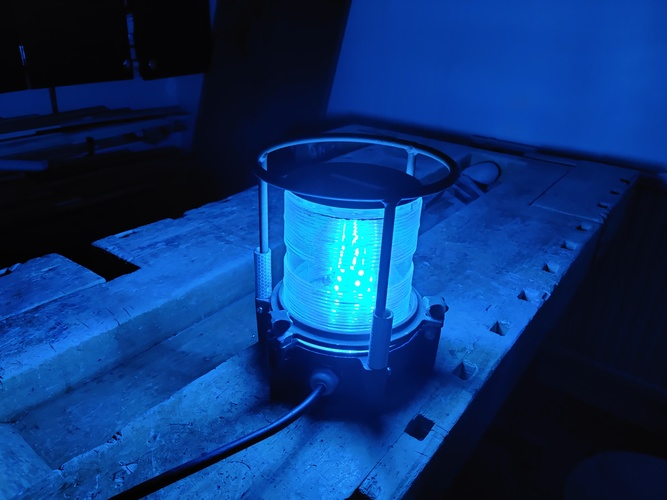

# Photos of my light

I built the circuit to a project board. It has a 3.3V DC-DC converter for the ESP8266, the ESP8266 and
three 2N2222 transistors for driving the strip. Each color takes about 300 mA and a 2N2222 is capable for
much more.

Test run. That blue LCD and Raspberry Pi 3 on the background are for another project that will be published later.

Another test run

Building

It illuminates!

On my front yard during the Earth Hour 2021

